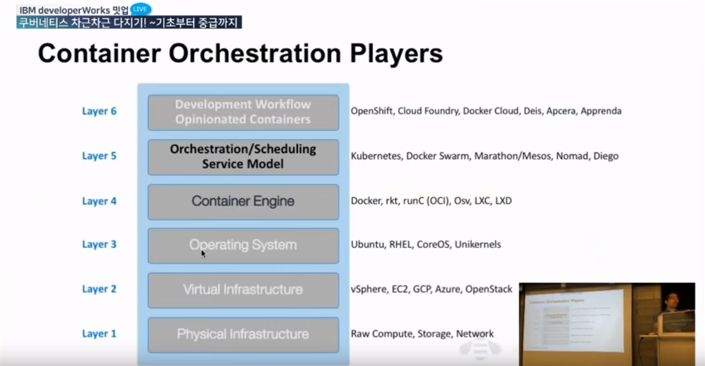
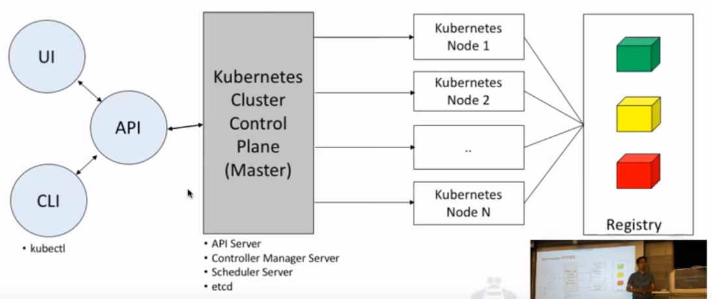

<div align=right>
    <a href="https://github.com/LunightLab">
        </a>
    </a>
    <a href="https://github.com/LunightLab/LuLabTemplate">
        </a>
    </a>
</div>

Note
====

**<div align=right> 워크샵 내용정리 </div>**

### Cloud Native 12 요소

**클라우드 애플리케이션 개발 방법론(2011. Adam Wiggins)**

-	설정 자동화를 위한 절차(declarative) 를 체계화 하여 새로운 개발자가 프로젝트에 참여하는데 드는 시간과 비용을 최소화한다.  
-	OS에 따라 달라지는 부분을 명확히하고, 실행 환경 사이의 이식성을 극대화 한다.  
-	최근 등장한 클라우드 플랫폼 배포에 적합하고, 서버와 시스템의 관리가 필요없게 된다.  
-	개발 환경과 운영 환경의 차이를 최소화하고 민첩성을 극대화하기 위해 지속적인 배포가 가능하다.  
-	툴, 아키텍처, 개발 방식을 크게 바꾸지 않고 확장(scale up) 할 수 있다.

**The Twelve Factors**

```
I. 코드베이스
버전 관리되는 하나의 코드베이스와 다양한 배포

II. 종속성
명시적으로 선언되고 분리된 종속성

III. 설정
환경(environment)에 저장된 설정

IV. 백엔드 서비스
백엔드 서비스를 연결된 리소스로 취급

V. 빌드, 릴리즈, 실행
철저하게 분리된 빌드와 실행 단계

VI. 프로세스
애플리케이션을 하나 혹은 여러개의 무상태(stateless) 프로세스로 실행

VII. 포트 바인딩
포트 바인딩을 사용해서 서비스를 공개함

VIII. 동시성(Concurrency)
프로세스 모델을 사용한 확장

IX. 폐기 가능(Disposability)
빠른 시작과 그레이스풀 셧다운(graceful shutdown)을 통한 안정성 극대화

X. 개발/프로덕션환경 일치
개발, 스테이징, 프로덕션 환경을 최대한 비슷하게 유지

XI. 로그
로그를 이벤트 스트림으로 취급

XII. Admin 프로세스
admin/maintenance 작업을 일회성 프로세스로 실행
```

> [The Twelve Factors](https://12factor.net/ko/)

### MSA(Micro Service Architecture)

**<div align=center> "하나의 큰 어플리케이션을 여러개의 작은 어플리케이션으로 쪼개어 변경과 조합이 가능하도록 만든 아키텍쳐" </div>**

MSA의 반대 개념은 Monolithic Architecture(소프트웨어의 모든 구성요소가 한 프로젝트에 통합되어있는 형태를 의미)하며 Martin Folwer는 다음과 같이 정의하였다

*"the microservice architectural style is an approach to developing a single application as a suite of **small services, each running in its own process(스스로 돌아아갈 수 있는 작은 서비스)** and communicating with lightweight mechanisms, often an HTTP resource API. These services are built around business capabilities and **independently deployable(독립적 배포 가능)** by fully automated deployment machinery."*  
> https://martinfowler.com/articles/microservices.html

**MSA 장점**  
- 배포(deployment) : 서비스별 배포 가능하며 배포할 때 전체 서비스의 중단이 없고 요구사항을 신속하게 반영하여 빠르게 배포할 수 있다.  
- 확장(Scaling) : 특정 서비스에 대한 확장이 용이하여 클라우드 사용에 적합한 아키텍쳐  
- 장애(failure) : 장애가 전체 서비스로 확장될 가능성이 적어 부분적 장애에 대한 격리가 수월하다  
- 그외 신기술 적용이 유연하고 서비스를 polygot하게 개발 및 운영이 가능하다.

**MSA 단점**  
- 성능 : 서비스 간 호출시 API를 사용하기 때문에, 통신비용이나 Latency가 늘어난다.  
- 테스트/ 트랜잭션 : 서비스가 분리되어 있기 때문에 테스트와 트랜젝션의 복잡함이 증가하고 많은 리소스가 필요  
- 데이터 관리 : 데이터가 여러 서비스에 걸쳐 분산되기 때문에 조회가 어렵고 관리가 어렵다.

###DevOps  
- Dev(개발)과 Ops(운용)이 긴밀한 협조 및 연계하여 **비즈니스 측면의 가치를 높이는 근무 방식과 문화**. 일하는 방법으로 개발에 한정된 방법론이 아니라, 팀 빌딩(Team Building), 개발 프로세스 설계 등의 조직 구성, 문화까지 포함되어 있는 사고방식을 의미  
- 애자일(Agile)방법론에서 운용과제를 해결하기 위해 개선된 조직문화를 의미.  
- Grafana 모니터링 툴을 꼭 사용해보자

###Containers  
- 독립된 소프트웨어 컨셉  
- Linux Container(isolate 기술)을 활용하여 도커가 개발됨.  
- 컨테이너 런타임(Docker) : 컨테이너가 실행하고 핸들링해주는 시스템

###Container Image  
- Read-Only Image 생성  
- bootfs를 kernel level로 공유  
- Image registry에서 Container Image 관리

###Kubernetes

**Container Orchestration**  
**<div align=center> "Container+Container+Container+Container+Container+Container.... 관리" </div>**  
방대한 컨테이너들을 통제하고 안정적인 서비스를 목표로하는 운영에서 체계적인 관리가 필요하다. 이런 역할을 하는 Container Orchestration Platform을 의미한다.

**역할**  
- 스케줄링  
- 클러스터관리 - 서비스 복구  
- 모니터링 - 설정

**Container Orchestration Players(1~6 Layer)**  
Kubernetes와 Docker Swarm 등이 있다.  
<p align="center"></p>

**Kubernetes**  
*"Kubernetes is an open-source system for automating depeloyment, scaling, and management of containerized applications."* http://kubernetes.io

-	2015년부터 시작되었다.  
-	다양한 클라우드 및 베어 메탈 환경을 지원한다.  
-	Google Borg에서 시작디어 오픈소스화됨.  
-	Go언어 기반으로 되어있음  
-	CNCF로 기부됨  

**특징**  
- **Automatic binpacking**  
가용성에 대한 희생 없이, 리소스 사용과 제약 사항을 기준으로 자동으로 컨테이너를 스케줄

-	**Self-healing**  
	자동으로 문제가 발생한 노드의 컨테이너를 대체 (룰/정책에 따른 헬스 체크)

-	**Horizontal scaling**  
	CPU, 메모리와 같은 리소스 사용에 따라 자동으로 애플리케이션을 확장  
	경우에 따라서, 사용자 정의 측정 값을 기준으로한 동적인 확장 가능

-	**Service discovery and Load balancing**  
	Container에 고유한 IP를 부여  
	여러 개의 Container를 묶어 단일 service로 부여하는 경우 단일 DNS name으로 접근하도록 로드 밸런싱을 제공

-	**Automatic rollouts and rollbacks**  
	다운타임 없이 애플리케이션의 새로운 버젼 및 설정에 대한 롤아웃/롤백 가능

-	**Secret and configuration management** 애플리케이션의 secret과 configuration 정보를 이미지와 독립적으로 구분하여 별도의 이미지 재생성 없이 관리

-	**Storage orchestration**  
	소프트웨어 정의 저장장치(Software Defined Storage)를 기반으로 로컬, 외부 및 저장소 솔루션 등을 동일한 방법으로 컨테이너에 마운트 할 수 있음

-	**Batch execution**  
	CI 워크로드와 같은 Batch성 작업 지원

-	**crontab 형식으로 스케쥴링도 가능**

**Kubernetes 아키텍쳐**  
<p align="center"></p>

###참고자료  
> [IBM 쿠버네티스 강의](https://www.youtube.com/watch?v=l42GttmnnZ4&list=PLKQw1Ska3hjpnFBbQJJrnJIUE062OCyKo#action=share)  
> [kubernetes](https://kubernetes.io/)

<div align="center">

<sub><sup>Written by <a href="https://github.com/LunightLab">@Lunight</a></sup></sub><small></small>

</div>
